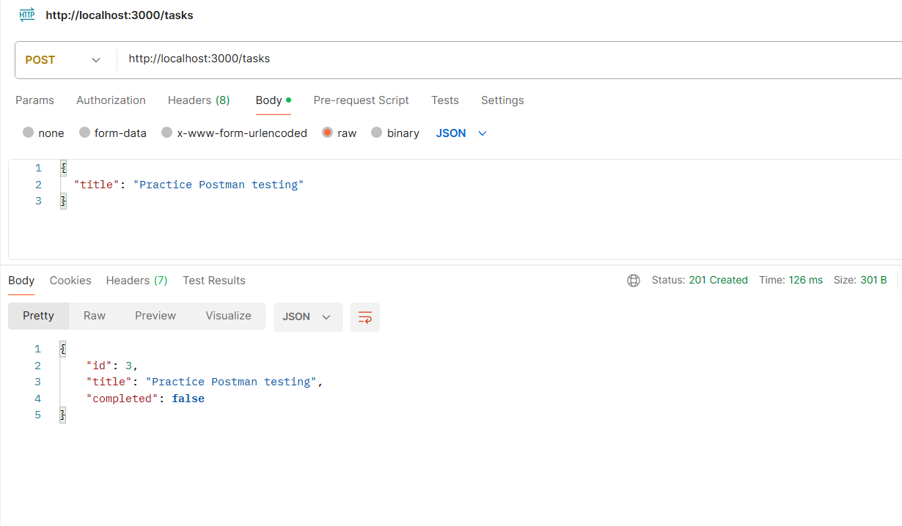
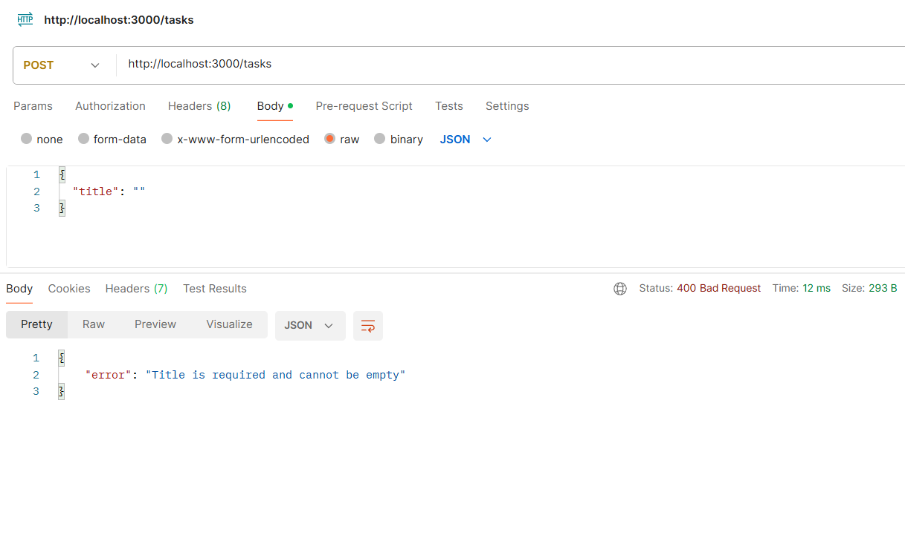
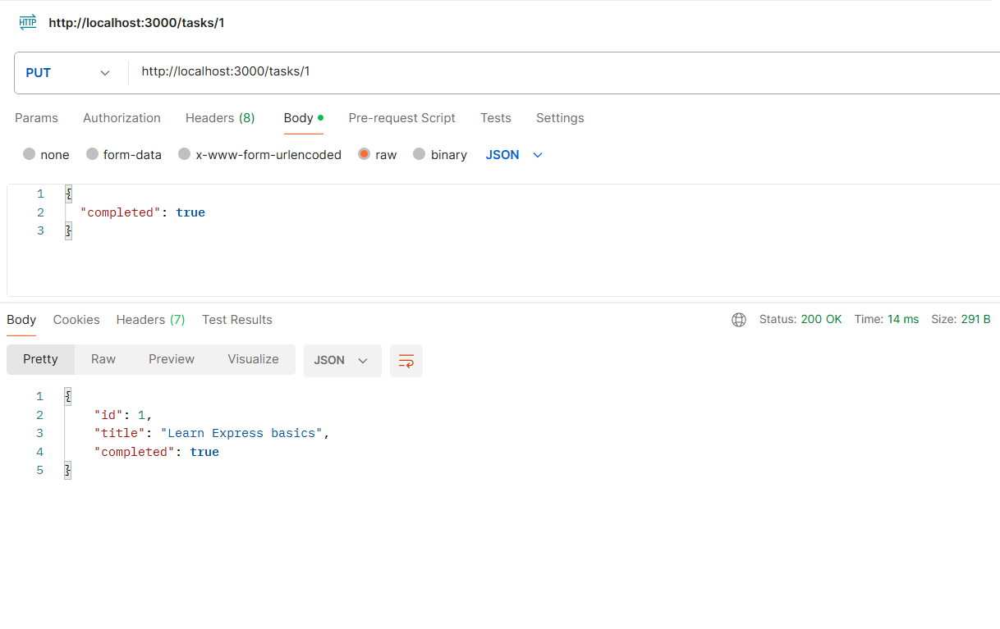
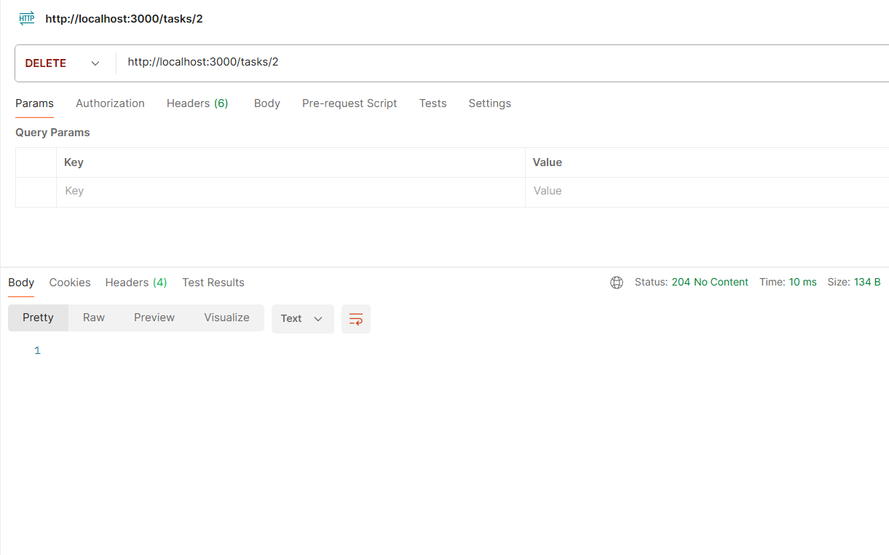
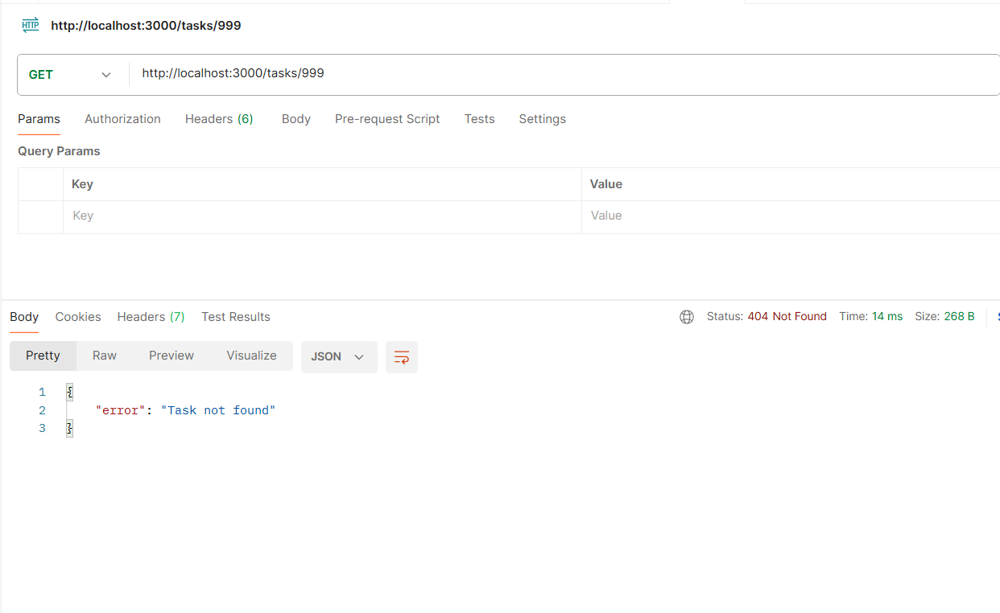

# Task Manager API
Backend API Development
A simple RESTful backend API built with Node.js and Express, developed as part of the Full Stack Development Industrial Training Kit 

## Description

This API allows users to manage a list of tasks. It demonstrates core backend concepts including RESTful endpoint design, HTTP methods (GET, POST, PUT, DELETE), data validation, and appropriate use of HTTP status codes.

## Features

- Retrieve all tasks
- Retrieve a single task by ID
- Add a new task (with title validation)
- Update an existing task's title or completion status
- Delete a task

## Tech Stack

- Node.js
- Express.js

## Project Structure
```
task-manager-api/
├── server.js          # Main application file with all routes
├── package.json        # Project dependencies and metadata
├── package-lock.json   # Locked dependency versions
├── .gitignore           # Files excluded from Git
└── README.md            # Project documentation
```


## API Endpoints

| Method | Endpoint       | Description                  |
|--------|----------------|-------------------------------|
| GET    | /              | Health check / welcome message |
| GET    | /tasks         | Get all tasks                 |
| GET    | /tasks/:id     | Get a single task by ID        |
| POST   | /tasks         | Create a new task              |
| PUT    | /tasks/:id     | Update a task                  |
| DELETE | /tasks/:id     | Delete a task                  |

## How to Run Locally

1. Clone this repository
2. Install dependencies:
   npm install
3. Start the server:
   node server.js
4. The server will run on `http://localhost:3000`

## How to Test the API

Since browsers can only send GET requests, use a tool like [Postman](https://www.postman.com/) to test POST, PUT, and DELETE requests.

Example: To create a new task, send a POST request to `http://localhost:3000/tasks` with this JSON body:

```json
{
  "title": "Your task title"
}

## Example Request (POST /tasks)

```json
{
"title": "Learn REST APIs"
}
```
## Status Codes Used
- 200 OK – Successful GET/PUT
- 201 Created – New task successfully created
- 204 No Content – Successful deletion
- 400 Bad Request – Invalid input data
- 404 Not Found – Task does not exist

## Author
Ajeetha Betsy

## API Testing Screenshots

### Successful Task Creation (POST)





### Validation Error (POST with empty title)





### Update Task (PUT)





### Delete Task (DELETE)





### Task Not Found (GET invalid ID)


